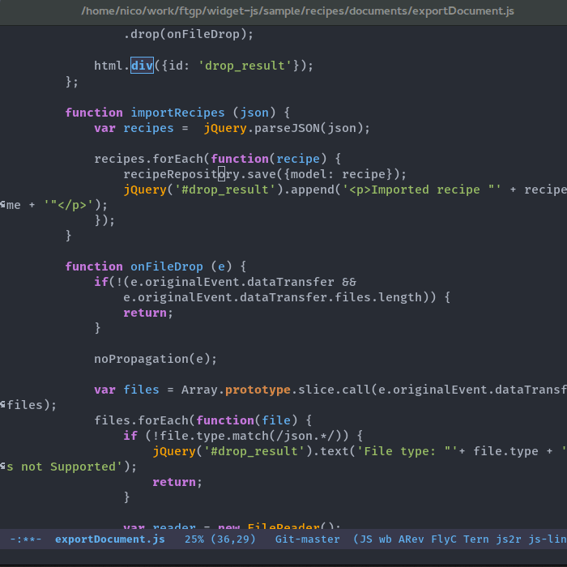
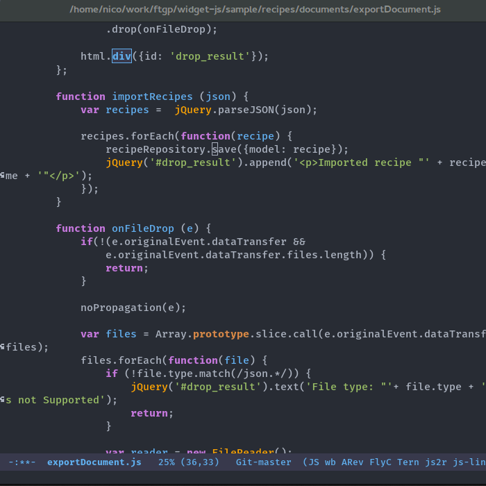
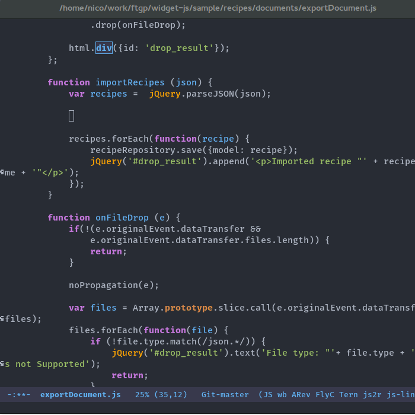
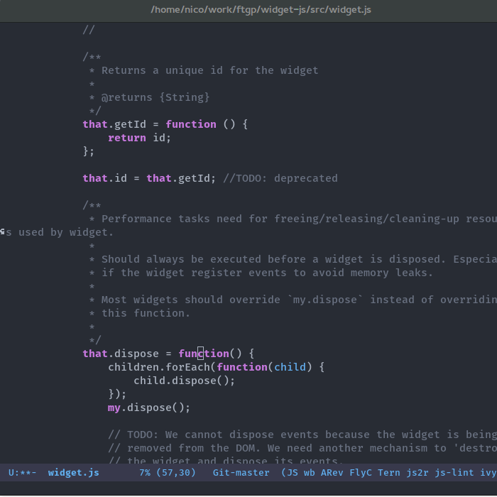
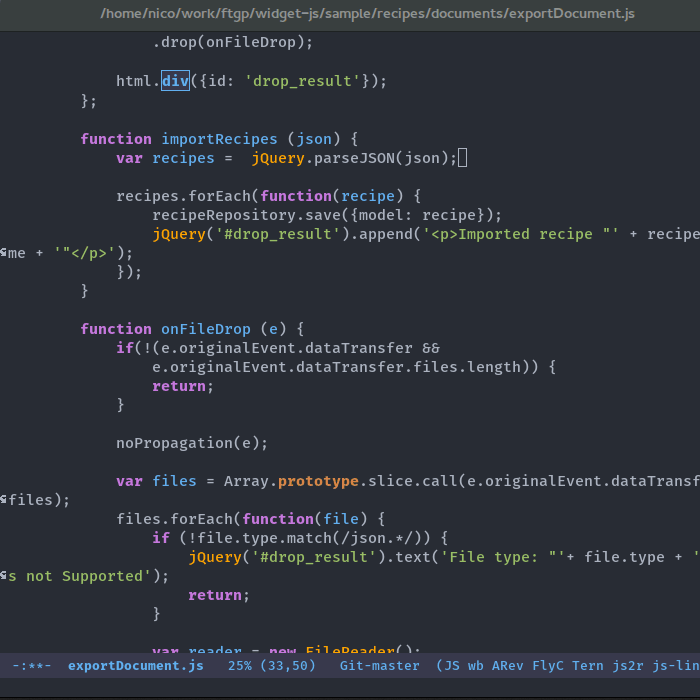
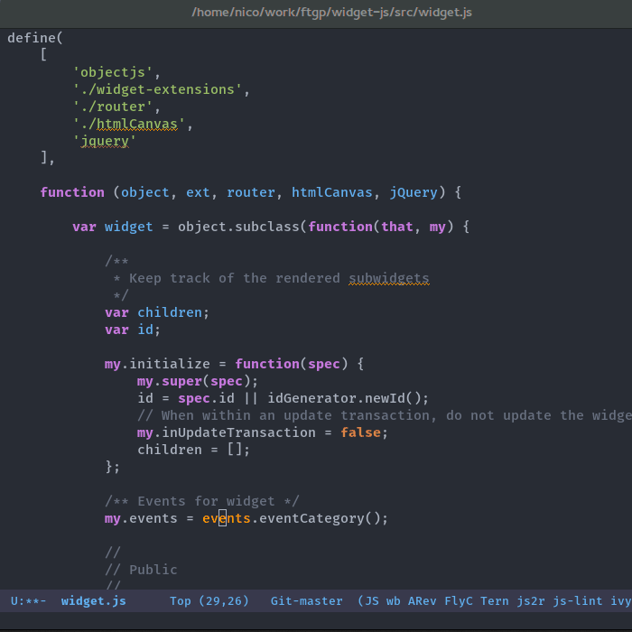
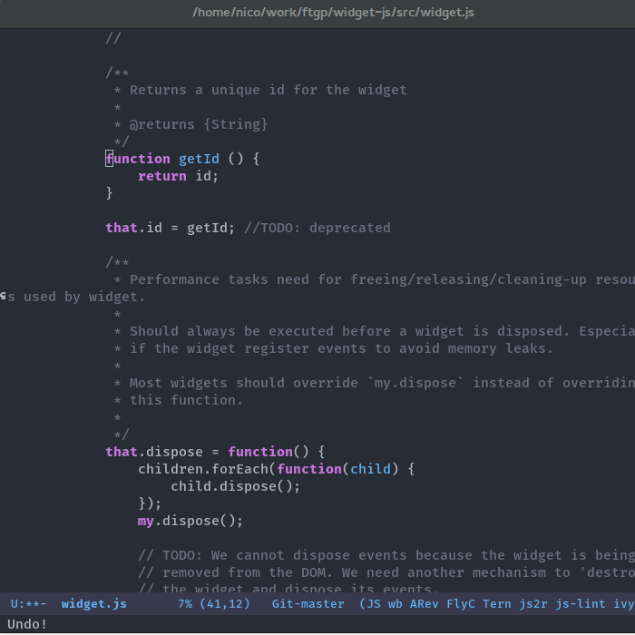

# emacs-js
Emacs configuration files for editing JavaScript

## Description

This package aims to simplify the installation and setup of a good development
environment for editing JavaScript files.

Some of the settings might specific to how we do JavaScript at Företagsplatsen,
but most of it should be generic enough to be reused.

The package provides:

- Navigation to definitions and references using [xref-js2](https://github.com/NicolasPetton/xref-js2)
- Smart completion and type inference using tern and company-mode
- JavaScript refactorings with [js2-refactor](https://github.com/magnars/js2-refactor.el)
- Linting with [Flycheck](https://github.com/flycheck/flycheck)
- Grunt integration
- AMD module handling using [amd-mode](https://github.com/NicolasPetton/amd-mode.el)
- Good defaults and settings of the above packages

This package also provides a helper mode for editing JavaScript projects that
use [WidgetJS](https://github.com/foretagsplatsen/widget-js).

## Requirements

- Emacs 25 (pretests available [here](http://alpha.gnu.org/gnu/emacs/))
- [MELPA](http://melpa.org/)
- `ag` (the [silver searcher](http://geoff.greer.fm/ag/))
- `tern` ([website](http://ternjs.net/))

## Installation

1. Remove any JS settings from your Emacs configuration (*backup everything before!*)
2. Make sure you have setup Emacs package.el to use MELPA
3. Clone this repository in your `.emacs.d` (as a submodule if your emacs
   settings are versioned using git)
4. In `emacs-js`, run `git submodule init && git submodule update`
5. Add the following to your `.emacs.d/init.el`:

```
(load-file "emacs-js/emacs-js.el")
```

*Enjoy!*

## Settings

- Tern is used for code completion & doc only
- tabs are used for code indentation
- The formatting of JavaScript code is slightly different from the one provided
  in js-mode, following the standards we have at Företagsplatsen.
- `C-k` Kills the line but does not break the AST! (see `js2r-kill`)


## Screencasts

### Jumping to definition



### Jumping to references



### Code completion



### Documtentation



### Refactorings



### AMD modules



### Crockford style helpers




## Keybindings

This section lists most keybindings of the installed packages:

### Navigation
- `M-.` Jump to the definition at point
- `M-?` Jump to references (usages) of the symbol at point
- `M-,` Pop back to where `M-.` was last invoked

### Completion

Completion starts automatically. When completing:

- `M-s` Search within the available completion candidates
- `M-n` Go to the next completion candidate
- `M-p` Go to the previous completion candidate

See the documentation of `company-mode` for more.

### Documentation

- `C-c C-d`: Show the documentation for the function at point in the echo area
- `C-c C-d C-c C-d`: Open a web browser tab on the documentation of the function
  at point
- `C-c m`: Start a search on the Mozilla Developer Network

### AMD module handling

- `C-c C-a s`: `amd-search-references`: Search for modules that require the buffer's file.
- `C-c C-a f`: `amd-import-file`: Prompt for a file to import. When called with
  a prefix argument, always insert the relative path of the file.
- `C-c C-a m`: `amd-import-module`: Prompt for a module name to import.
- `C-c C-a o`: `amd-find-module-at-point`: Find a module named after the node at
  point.
- `C-c C-a a`: `amd-auto-insert`: Insert an empty module definition.

### WidgetJS / Crockford style

- `C-c C-w m`: Convert function to method on `my`
- `C-c C-w t`: Convert function to method on `that`
- `C-c C-w l`: Make the string at point translatable, surrounding it with `_()`
- `C-c C-w h`: Expand a lisp list into a WidgetJS HTML rendering

### Refactorings

- `C-c C-r e f` is `extract-function`: Extracts the marked expressions out into a new named function.
- `C-c C-r i p` is `introduce-parameter`: Changes the marked expression to a parameter in a local function.
- `C-c C-r l p` is `localize-parameter`: Changes a parameter to a local var in a local function.
- `C-c C-r e o` is `expand-object`: Converts a one line object literal to multiline.
- `C-c C-r c o` is `contract-object`: Converts a multiline object literal to one line.
- `C-c C-r e u` is `expand-function`: Converts a one line function to multiline (expecting semicolons as statement delimiters).
- `C-c C-r c u` is `contract-function`: Converts a multiline function to one line (expecting semicolons as statement delimiters).
- `C-c C-r e a` is `expand-array`: Converts a one line array to multiline.
- `C-c C-r c a` is `contract-array`: Converts a multiline array to one line.
- `C-c C-r w i` is `wrap-buffer-in-iife`: Wraps the entire buffer in an immediately invoked function expression
- `C-c C-r i g` is `inject-global-in-iife`: Creates a shortcut for a marked global by injecting it in the wrapping immediately invoked function expression
- `C-c C-r e v` is `extract-var`: Takes a marked expression and replaces it with a var.
- `C-c C-r i v` is `inline-var`: Replaces all instances of a variable with its initial value.
- `C-c C-r r v` is `rename-var`: Renames the variable on point and all occurrences in its lexical scope.
- `C-c C-r a o` is `arguments-to-object`: Replaces arguments to a function call with an object literal of named arguments.
- `C-c C-r 3 i` is `ternary-to-if`: Converts ternary operator to if-statement.
- `C-c C-r s v` is `split-var-declaration`: Splits a `var` with multiple vars declared, into several `var` statements.
- `C-c C-r s s` is `split-string`: Splits a `string`.
- `C-c C-r u w` is `unwrap`: Replaces the parent statement with the selected region.
- `C-c C-r l t` is `log-this`: Adds a console.log() statement for what is at point (or region).
- `C-c C-r d t` is `debug-this`: Adds a debug() statement for what is at point (or region).
- `C-c C-r s l` is `forward-slurp`: Moves the next statement into current function, if-statement, for-loop or while-loop.
- `C-c C-r b a` is `forward-barf`: Moves the last child out of current function, if-statement, for-loop or while-loop.
- `C-c C-r k` is `kill`: Kills to the end of the line, but does not cross semantic boundaries.

There are also some minor conveniences bundled:

- `C-S-down` and `C-S-up` moves the current line up or down. If the line is an
   element in an object or array literal, it makes sure that the commas are
   still correctly placed.
